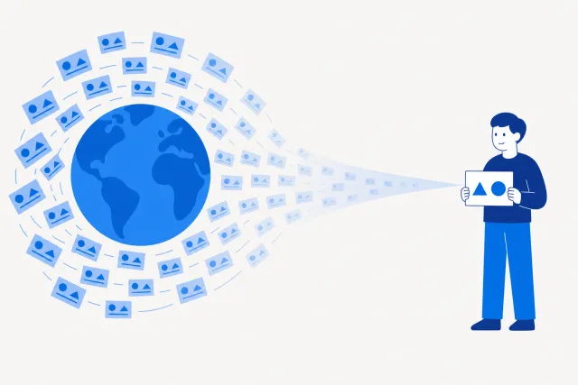
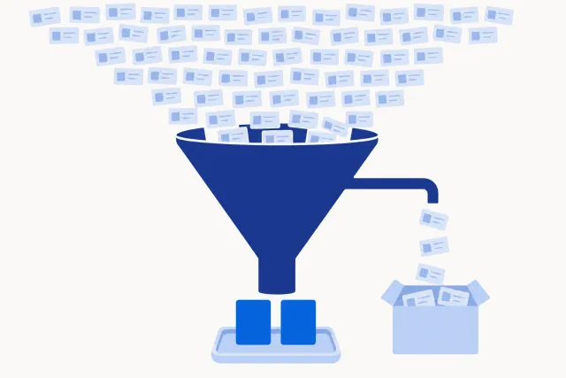

[Русский](README.md) · English

# SWOT News — a daily personal SWOT of world news

A Claude Code plugin: it takes the fresh [Kagi News](https://news.kagi.com) batch (public API, no key) and writes a compact delta issue — which of today's events actually touch you, and what to do about them.

## Why

A feed gives you emotion, not a position: an important story and *your* story are different stories. As long as an event has nothing to do with you, it stays somebody else's importance — and by the evening it leaves neither a decision nor a trace.

The plugin puts selection and analysis between the feed and you (tag `swot-news--v2.0.1`):

- Reads only the topics you picked at onboarding out of the live Kagi catalogue (the skill quotes roughly 165 topics; a valid pick is 12–60, a comfortable one 25–40).
- Spreads them across 1–4 clusters and starts one analyst per cluster plus an enricher — in parallel, in a single message.
- Every candidate gets two scores — impact and likelihood — and reaches the issue only if it changes something for you.
- Writes a **delta**, not a recap: new, escalating, fading, unchanged — relative to yesterday's issue.
- Recurring topics become base cards with their own history; ≥ 14 days without mentions marks a card as fading, ≥ 30 archives it.

## What it looks like





<details>
<summary>What appears in the working folder and what an entry looks like (synthetic example)</summary>

Folder names follow the language of your working folder; the example below is the Russian layout the plugin ships with.

```text
My-folder/
├── Контекст.md          profile, interests, priorities — read on every run
├── SWOT.md              base table of contents
├── _Watchlist.md        candidate topics that are not cards yet
├── Силы/  Слабости/  Возможности/  Угрозы/     cards for confirmed topics
├── Выпуски/
│   └── SWOT_2026-09-06.md
└── .swot-news/config.json
```

An issue entry uses one frame: what happened → why it matters to me → what to do:

```markdown
### O-2026-011 · A key vendor adds a cheaper tier · 🆕 new · Now

**What happened.** The vendor my working setup depends on introduces a tier
below the one I am on.

**Why it matters to me.** It directly affects the cost of my main tool.

**Score.** Impact 3 × likelihood 4 = 12 → monitor.

**What to do.** Compare with the current tier at the end of the week, before renewal.

**Plan B.** If the tier disappears, I stay where I am and nothing breaks.
```

</details>

## Install

Paste this block to an agent in Claude Code opened in your working folder:

```text
You are an installer. Do exactly these steps and nothing beyond them:
1. Bash: claude plugin marketplace add https://github.com/beCyborg/jadlis-start.git
2. Bash: claude plugin install swot-news@jadlis
3. Tell me in one line: "Send /reload-plugins, then write: /swot-news:setup"
Do not read, create or install anything else.
```

The manual path is the same commands. The main channel is the `jadlis` hub, where the plugin is sub-step 6.3 of the handover route:

```bash
claude plugin marketplace add https://github.com/beCyborg/jadlis-start.git
claude plugin install swot-news@jadlis
```

The repository's legacy marketplace (`swot-news-plugin`) stays in place for installs already made — they keep working after the repository rename.

The full HTTPS URL is required: the short `owner/repo` form expands to an SSH address, and a new user usually has no SSH key. Third-party marketplaces do not auto-update by default: run `claude plugin update swot-news@jadlis` (or `@swot-news-plugin`), or turn auto-update on once in `/plugin` → Marketplaces.

Detailed install and troubleshooting — **[docs/УСТАНОВКА.md](docs/УСТАНОВКА.md)** (Russian).

## Usage

Three typical scenarios:

1. **First run** — `/swot-news:setup`. It inspects the folder, interviews you about your profile, walks the Kagi topic catalogue, balances clusters and creates the structure. Without a config, `daily` prints one line and creates nothing.
2. **Daily issue** — `/swot-news:daily-news-swot`. Collect → analyse → issue → digest in chat. It asks no questions, so it is safe on a schedule; `--force` overwrites today's issue.
3. **Adjust a setting** — `/swot-news:setup --recheck` (rebuild the category list, the Kagi catalogue changes) or `/swot-news:setup --profile` (profile only, categories untouched).

Every config field — **[docs/НАСТРОЙКА.md](docs/НАСТРОЙКА.md)** (Russian).

## Limits and cost

What it needs and what it does not do:

- **It needs context about you.** Selection runs against `Контекст.md` — profile, interests, priorities. An empty context turns the issue back into an ordinary feed.
- **Requirements:** Claude Code (CLI or desktop), Python 3.9+ (standard library only, nothing to install), network access to `news.kagi.com`. No API keys and no paid subscriptions.
- **Optional:** Brave Search MCP — when connected, the daily enrichment goes through it; otherwise through the built-in web search, or not at all. Obsidian is detected automatically: with it you get wikilinks, callouts and a `.base` dashboard, without it plain Markdown.
- **An empty day stays empty.** If the batch is no newer than the last issue, no note is written and one line goes to the chat. A failed run leaves no junk files.
- **Cluster files weigh megabytes** and are never read into the main context — analysts get paths, not contents.

## Data and licences

- Plugin code — no license: read and use it personally; all rights reserved.
- Kagi News data — **CC BY-NC 4.0**: non-commercial use with attribution. The attribution is inserted into every issue footer automatically; do not remove it.
- The Kagi News API is public and marked beta — it may change. If it is unavailable the script returns a clear error and the run ends in a single line.
