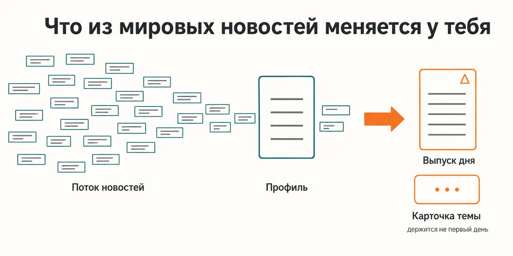
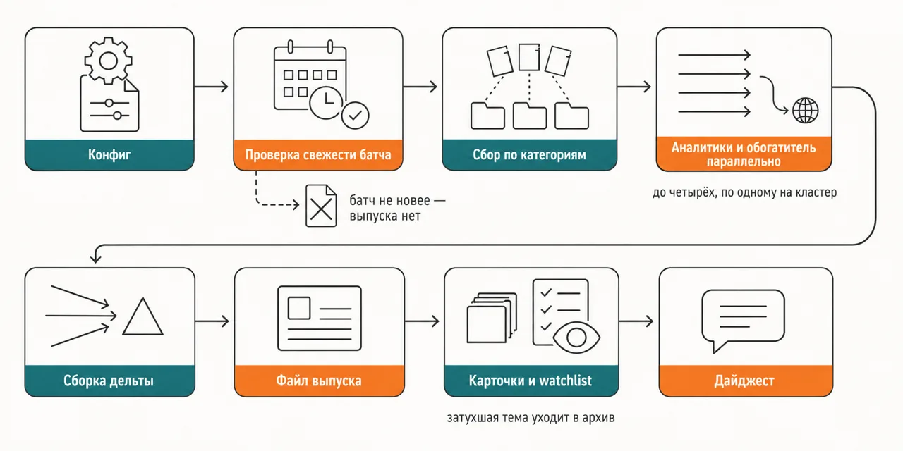

Русский · [English](README.en.md)

# Ты знаешь, что случилось в мире, и не знаешь, что из этого меняется у тебя

Выбранные тобой направления Kagi News разбирают параллельные аналитики через файл с твоим
профилем, а в заметку дня ложится только дельта — что появилось, что усилилось, что затухает.

```
claude plugin marketplace add https://github.com/beCyborg/jadlis-start.git
claude plugin install swot-news@jadlis
```

Ключи не нужны — источник один, и это публичный API Kagi News; но до первого выпуска стоит
онбординг `/swot-news:setup` в той папке, где будут жить заметки.



Текстом: слева общий поток новостей, посередине — файл с твоим профилем, справа — короткий
выпуск дня и карточка темы, которая держится не первый день.

Это моё рабочее место, выложенное как есть, а не продукт: чем перестал пользоваться — убрал.

## Было → стало

| Руками | Чатом с ИИ | Этим плагином |
|---|---|---|
| **Чья это важность.** Лента сортирует по важности вообще, и твоей роли в событии в ней нет. | Пересказывает и сокращает то, что ты принёс: профиля, под который отбирать, у него нет. | Каждая история проходит через `Контекст.md` — занятие, локация, приоритеты, интересы и неинтересы — и попадает в выпуск, только если что-то меняет у тебя. |
| **Одна и та же тема каждый день.** Возвращается неотличимой от вчерашней, и не видно, сдвинулась она или стоит. | Разбирает её заново с чистого листа, вчерашней версии рядом нет. | Сверяет тему с карточками базы и с watchlist и пишет дельту: новое, эскалация, затухание; неизменившееся уходит одной строкой. |
| **Что остаётся назавтра.** Вкладки закрыты, следа нет. | Разбор остаётся в переписке и там же теряется. | Выпуск и карточки — Markdown-файлы в твоей папке; тема, продержавшаяся не один день, становится карточкой с историей, а брошенная сама уходит в архив. |
| **День, когда новостей нет.** Листаешь всё равно: заранее не видно, что ничего не вышло. | Ответит на любой запрос, даже когда отвечать не на чем. | Сверяет `batch_id` свежего батча с последним выпуском: батч не новее — файл не создаётся, в чат уходит одна строка. |
| **Кто нажимает кнопку.** Ритуал держится на тебе и рвётся в первую занятую неделю. | Нужен живой диалог: без твоих ответов ход не заканчивается. | У ежедневного скилла инструмент вопросов отключён в самом скилле, и ход обязан завершиться сам — его можно поставить в `/schedule`. |

## Как это работает



На входе — свежий батч Kagi News по выбранным тобой направлениям и твой `Контекст.md`.
Внутри — гейт конфига и проверка свежести батча, потом категории расходятся по кластерам,
на каждый кластер свой аналитик, а темы «Мониторить ежедневно» уходят обогатителю в веб.
На выходе — выпуск дня, обновлённые карточки базы и дайджест в чат.

Текстом: конфиг → проверка свежести батча → сбор по категориям → аналитики и обогатитель
параллельно → сборка дельты → файл выпуска → карточки и watchlist → дайджест.

Собирает данные один скрипт на стандартной библиотеке Python: тянет батч по пиненному
`batch_id`, чтобы `/latest` не сменился на середине сбора, и раскладывает категории по кластерным
файлам во временной папке системы. В основной контекст эти файлы не читаются никогда — аналитик
получает путь и ходит по нему грепом и кусками. Аналитиков от одного до четырёх, по одному на
кластер; каждый возвращает кандидатов с двумя оценками, силой удара и вероятностью, и с
дельта-статусом относительно уже известных тем.

Раскладывает находки дня по базе отдельный шаг, и порядок операций в нём зафиксирован: сначала
чистка watchlist, потом сопоставление с карточками, потом промоушен темы из watchlist в карточку,
потом новые темы и проверка на затухание. Тема без упоминаний долгое время сначала помечается
затухающей, потом уходит в архив — файл при этом не удаляется. Выпуск пишется в двух режимах
разметки: онбординг сам смотрит, лежит ли папка в Obsidian-vault, и включает либо wikilinks с
callout'ами, либо обычный Markdown.

## Установка и первый запуск

**а) Текст для вставки агенту.** Скопируй целиком в чат Claude Code:

```
Ты — установщик. Поставь на эту машину плагин swot-news из маркетплейса jadlis.
Сначала проверь интерпретатор: python3 --version, не нашёлся — python --version,
затем py -3 --version. Версия ниже 3.9 или ни одна команда не сработала — остановись
и скажи мне об этом, плагин без Python не соберёт новости.
Выполни ровно эти команды, дословно, ничего не сокращая:
1. claude plugin marketplace add https://github.com/beCyborg/jadlis-start.git
2. claude plugin install swot-news@jadlis
3. claude plugin list — покажи мне строку про swot-news и его версию.
Ключей этот плагин не просит: источник новостей — публичный API без ключа.
Онбординг /swot-news:setup сам не запускай — его запущу я, из своей рабочей папки.
Перед каждой командой покажи её мне целиком и дождись «да». Сказал «нет» — не выполняй,
скажи, что именно пропустил, и иди дальше.
Команда вернула ошибку — остановись, покажи вывод, к следующей не переходи.
```

**б) Команды руками.**

```
claude plugin marketplace add https://github.com/beCyborg/jadlis-start.git
claude plugin install swot-news@jadlis
claude plugin list
```

Первая команда ничего не ставит — она добавляет маркетплейс. Ставит только вторая, и снимается
она одной строкой: `claude plugin uninstall swot-news@jadlis --keep-data`.

**в) Короткая команда.** Входного скилла с голым именем плагина здесь нет: `/swot-news` не
найдётся, команды пишутся полными формами. Открой Claude Code в той папке, где будут жить
выпуски, и один раз пройди онбординг:

```
/swot-news:setup
```

Дальше, в той же папке, — ежедневный прогон:

```
/swot-news:daily-news-swot
```

Не находятся — сверь имя плагина строкой `claude plugin list`. При установке ничего не
настраивается: все настройки появляются на онбординге и ложатся в `.swot-news/config.json`
рядом с твоими заметками. Ежедневный скилл ищет этот файл от рабочей папки вверх по дереву
папок, а заодно на уровень внутрь — значит запускать его надо в той же папке, в её подпапке
или в папке над ней. Работаешь из совсем другого места — путь к конфигу задаётся переменной
окружения `SWOT_NEWS_CONFIG`. Батч Kagi выходит раз в сутки, около полудня по UTC; запускать
имеет смысл, когда он уже вышел.

## Границы, стоимость, обновление

**Чего не делает.** Не ищет новости сам: источник один — публичный API Kagi News, и чего нет в
его батче, того не будет и в выпуске. Не проверяет утверждения перекрёстно: обогатитель ходит в
веб только по темам из раздела «Мониторить ежедневно» и только чтобы увидеть, не изменился ли
статус со вчера. Не переводит батч — `lang=ru` у API отдаёт английский контент, поэтому анализ
идёт по английскому батчу, а выпуск пишется по-русски. Не создаёт выпуск, пока не вышел свежий
батч; нужен всё равно — `/swot-news:daily-news-swot --force`. Не пишет за пределы твоей рабочей
папки, кроме временной папки системы, куда на время прогона ложатся кластерные файлы. И не
отправляет твой профиль наружу: `Контекст.md` читается локально и попадает только в промпты
субагентов твоей же сессии.

**Что нужно.** Ключи не нужны: API Kagi News публичный, статус beta. Нужен Python 3.9 или новее,
и только как интерпретатор — скрипт написан на стандартной библиотеке, зависимостей не ставит.
Необязательное: Brave Search MCP для ежедневного обогащения — без него обогатитель переключается
на Exa, без обоих на встроенный веб-поиск, а с пустым разделом «Мониторить ежедневно» не
запускается вовсе; Obsidian — онбординг сам заметит vault и включит wikilinks, callout'ы и
`.base`-дашборд. Данные Kagi News идут под CC BY-NC 4.0: некоммерческое использование с
атрибуцией, и атрибуция уже стоит в футере каждого выпуска — из шаблона её убирать нельзя.

[уточнить] — на Windows и Linux я не гонял ни разу, хотя скрипт умеет `py -3` и сам чинит
кодировку консоли.

**Порядок расхода токенов.** Тяжелее всего в прогоне сами аналитики: их от одного до четырёх, по
одному на кластер, плюс обогатитель — все одним параллельным заходом. Поэтому кластерные файлы в
основной контекст не попадают ни разу, субагентам передаются только пути. Удешевляется прогон
тремя ручками в конфиге и в Контексте: меньше кластеров, меньше записей в бюджете выпуска, пустой
раздел «Мониторить ежедневно» — тогда обогатитель не стартует.

**Проверено там, где я работаю:** мой Mac, моя подписка, мои настройки. Где ещё это работает —
[уточнить].

**Условия использования.** Лицензии нет: все права сохранены за автором. Читать и
пользоваться лично можно. Коммерческое использование, переиздание и включение в свои
продукты — по договорённости со мной.

**Обновление.** У стороннего маркетплейса авто-обновление на твоей стороне выключено: пока не
запустишь первую команду, у тебя остаётся та версия, которую ты поставил.

```
claude plugin marketplace update jadlis
claude plugin update swot-news@jadlis
claude plugin list
```

Переустановка, если что-то встало криво:

```
claude plugin uninstall swot-news@jadlis --keep-data && claude plugin install swot-news@jadlis
```
